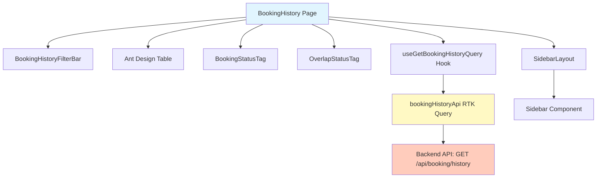
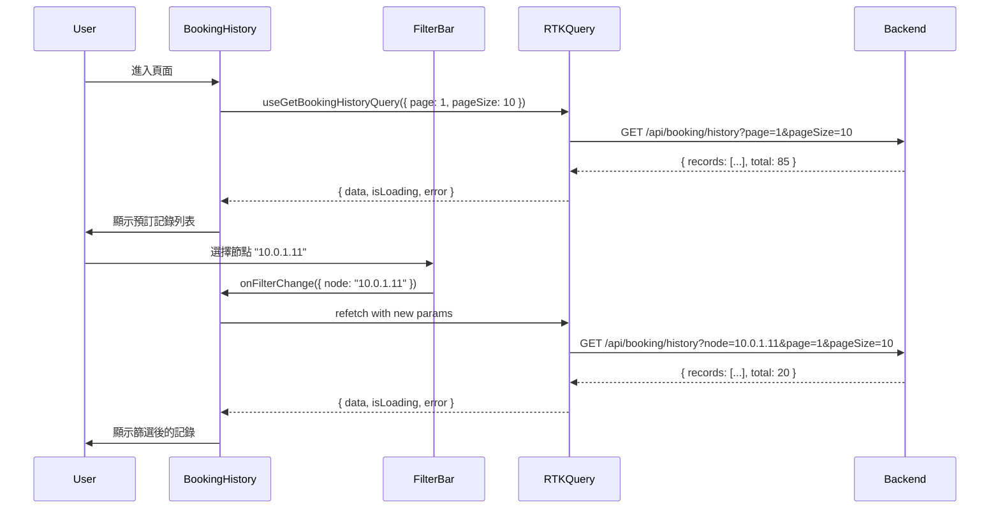

# Design Document

## Overview

預訂歷史 (Booking History) 功能是一個完整的資料查詢與管理介面，提供多維度篩選、分頁展示、視覺化狀態標籤以及詳細資訊查看功能。此功能整合於現有的 `booking` feature 模組中，遵循專案的 feature-based 架構模式，重用專案既有的佈局元件、設計系統與狀態管理方案。

技術實作採用 React 18 函式型元件、TypeScript 嚴格模式、Ant Design 5.x 企業級 UI 組件庫、Tailwind CSS v3 實用類別框架，並透過 RTK Query 處理 API 呼叫與快取。

## Steering Document Alignment

### Technical Standards (tech.md)

**遵循的技術標準：**

1. **React 18.3.1 + TypeScript 5.6.2**
   - 使用函式型元件（Function Component）
   - 採用 TypeScript 嚴格模式進行型別檢查
   - 遵循 React Hooks 最佳實踐（useState, useEffect）

2. **Ant Design 5.22.2 UI 組件庫**
   - 優先使用 AntD 組件：Table, Select, DatePicker, Input, Button, Tag, Card, Breadcrumb, Empty, Pagination
   - 透過 AntD props 控制樣式與行為，避免覆寫內建樣式
   - 利用 AntD 的主題系統（若專案有自訂主題）

3. **Tailwind CSS 3.4.15**
   - 用於版面排版（flex, grid, gap, justify, items）
   - 用於間距與尺寸控制（p-*, m-*, w-*, h-*）
   - 用於細節調整（rounded-*, shadow-*, border-*, bg-*, text-*）
   - 嚴格禁止使用 inline style（`style={{ }}`）

4. **Redux Toolkit 2.5.0 + RTK Query**
   - 使用 RTK Query 處理 API 呼叫與快取管理
   - 定義 bookingHistoryApi service 進行資料取得
   - 利用 RTK Query 的自動快取、重新驗證與錯誤處理機制

5. **React Router DOM 7.0.1**
   - 路由路徑：`/booking/history`
   - 整合於專案既有的路由配置（`src/routes.tsx`）

6. **i18next 國際化**
   - 所有使用者可見文字透過 i18next 進行國際化處理
   - 支援繁體中文（zh-TW）與英文（en）

7. **Day.js 時間處理**
   - 使用 Day.js 進行日期時間格式化
   - 格式：`YYYY-MM-DD HH:mm:ss`

### Project Structure (structure.md)

**遵循的專案結構規範：**

1. **Feature-based 模組化架構**
   ```
   src/features/booking/
   ├── pages/                  # 頁面元件
   │   └── BookingHistory.tsx
   ├── components/             # 可重用元件
   │   ├── BookingHistoryFilterBar.tsx (建議抽取)
   │   └── BookingStatusTag.tsx (建議抽取)
   ├── types/                  # TypeScript 型別定義
   │   └── booking-history.types.ts
   ├── api/                    # RTK Query API services
   │   └── bookingHistoryApi.ts (待建立)
   └── tests/                  # 測試檔案
       └── visual/
           └── BookingHistory.spec.ts
   ```

2. **路徑別名系統**
   - `@features/*` → `src/features/*`
   - `@shared/*` → `src/shared/*`
   - `@store/*` → `src/store/*`
   - `@styles/*` → `src/styles/*`
   - `@i18n/*` → `src/i18n/*`

3. **共用模組重用**
   - 佈局：`@shared/layouts/SidebarLayout`
   - 側邊欄：`@shared/components/Sidebar`

## Code Reuse Analysis

### Existing Components to Leverage

1. **SidebarLayout** (`src/shared/layouts/SidebarLayout.tsx`)
   - **用途：** 提供統一的側邊欄導航與主內容區域佈局
   - **重用方式：** 直接使用，傳入 `activeId="history"` 高亮當前頁面
   - **優點：** 自動處理桌面版固定側邊欄與手機版抽屜式選單

2. **Sidebar** (`src/shared/components/Sidebar.tsx`)
   - **用途：** 提供導航選單項目渲染
   - **重用方式：** 透過 SidebarLayout 間接使用
   - **整合點：** 需確保 sidebarItems 包含 "Booking History" 項目

3. **BookingTask 型別** (`src/features/booking/types/booking.types.ts`)
   - **用途：** 既有的預訂資料結構
   - **重用方式：** 參考其設計模式，建立獨立的 `BookingHistoryRecord` 型別
   - **差異：** BookingHistory 包含更多欄位（bookingId, node, image, group, account）

4. **Day.js**
   - **用途：** 日期時間格式化
   - **重用方式：** 格式化 `startTime` 和 `endTime` 為 `YYYY-MM-DD HH:mm:ss`

### Integration Points

1. **路由系統** (`src/routes.tsx`)
   - **整合方式：** 新增路由配置 `{ path: '/booking/history', element: <BookingHistory /> }`
   - **導航整合：** 更新 SidebarLayout 的 sidebarItems，加入 "Booking History" 導航項

2. **Redux Store** (`src/store/`)
   - **整合方式：** 註冊 `bookingHistoryApi.reducerPath` 至 store
   - **Middleware：** 加入 `bookingHistoryApi.middleware`

3. **後端 API**
   - **Endpoint：** `GET /api/booking/history`
   - **Query Parameters：** `startDate`, `endDate`, `node`, `group`, `status`, `keyword`, `page`, `pageSize`
   - **Response Format：** `{ records: [], total: number, page: number, pageSize: number, totalPages: number }`

4. **認證系統**
   - **整合方式：** 透過 RTK Query 的 baseQuery 自動附加 Authorization header
   - **權限驗證：** 後端 API 應驗證使用者是否有權限查看預訂記錄

## Architecture

### 系統架構概覽

BookingHistory 功能採用典型的 React + Redux Toolkit 三層架構：

1. **展示層（Presentation Layer）**
   - React 函式型元件 + Ant Design UI 組件
   - 負責 UI 渲染、使用者互動、狀態更新

2. **業務邏輯層（Business Logic Layer）**
   - RTK Query API service
   - 負責資料取得、快取管理、錯誤處理

3. **資料層（Data Layer）**
   - 後端 RESTful API
   - 負責資料查詢、篩選、分頁

### Modular Design Principles

- **Single File Responsibility：** 每個檔案專注於單一職責
  - `BookingHistory.tsx` → 頁面主元件，負責整合與佈局
  - `BookingHistoryFilterBar.tsx` → 篩選列元件，封裝篩選邏輯
  - `BookingStatusTag.tsx` → 狀態標籤元件，封裝標籤渲染
  - `booking-history.types.ts` → 型別定義，不包含邏輯
  - `bookingHistoryApi.ts` → API service，不包含 UI 邏輯

- **Component Isolation：** 建立小型、聚焦的元件
  - 主頁面元件不超過 500 行
  - 篩選列獨立為可重用元件
  - 狀態標籤獨立為可重用元件

- **Service Layer Separation：** 分離資料存取與呈現邏輯
  - RTK Query API service 處理所有 HTTP 請求
  - React 元件不直接使用 fetch 或 axios
  - 透過 hooks（`useGetBookingHistoryQuery`）取得資料

- **Utility Modularity：** 專注於單一用途的工具模組
  - 日期格式化使用 Day.js
  - 狀態配置封裝於 constants 或元件內部

### 架構圖



### 資料流程



## Components and Interfaces

### Component 1: BookingHistory (主頁面元件)

- **Purpose：** 預訂歷史頁面的主要容器，負責整合篩選、表格、分頁等子元件
- **Interfaces：**
  ```typescript
  const BookingHistory: React.FC = () => { ... }
  // 無 props，獨立頁面元件
  ```
- **Dependencies：**
  - `SidebarLayout` (既有佈局元件)
  - `BookingHistoryFilterBar` (篩選列元件)
  - `Ant Design Table, DatePicker, Select, Input, Button, Tag, Card, Breadcrumb, Empty`
  - `useGetBookingHistoryQuery` (RTK Query hook)
  - `BookingHistoryRecord`, `BookingHistoryFilterParams` (型別定義)
- **Reuses：**
  - `SidebarLayout` → 提供側邊欄佈局
  - `Day.js` → 日期格式化
  - 專案的 design tokens (Tailwind classes)

### Component 2: BookingHistoryFilterBar (篩選列元件)

- **Purpose：** 封裝所有篩選邏輯，提供日期範圍、節點、群組、狀態、關鍵字篩選與重置功能
- **Interfaces：**
  ```typescript
  interface BookingHistoryFilterBarProps {
    onFilterChange: (params: Partial<BookingHistoryFilterParams>) => void;
    nodeOptions: SelectOption[];
    groupOptions: SelectOption[];
    currentFilters: BookingHistoryFilterParams;
  }
  ```
- **Dependencies：**
  - `Ant Design RangePicker, Select, Input.Search, Button`
  - `Day.js` (日期處理)
- **Reuses：**
  - 可參考 `CalendarFilterBar` 的設計模式
  - Ant Design 的表單元件

### Component 3: BookingStatusTag (狀態標籤元件)

- **Purpose：** 封裝預訂狀態標籤的渲染邏輯與樣式配置
- **Interfaces：**
  ```typescript
  interface BookingStatusTagProps {
    status: BookingHistoryStatus; // 'pending' | 'running' | 'paused' | 'terminated'
  }

  const BookingStatusTag: React.FC<BookingStatusTagProps> = ({ status }) => { ... }
  ```
- **Dependencies：**
  - `Ant Design Tag`
  - `@ant-design/icons` (HourglassOutlined, PlayCircleOutlined, PauseCircleOutlined, StopOutlined)
- **Reuses：**
  - Ant Design Tag 的 color 與 icon props

### Component 4: OverlapStatusTag (重疊狀態標籤元件)

- **Purpose：** 封裝時間重疊狀態標籤的渲染邏輯
- **Interfaces：**
  ```typescript
  interface OverlapStatusTagProps {
    overlapStatus: OverlapStatus; // 'allowed' | 'not-allowed'
  }

  const OverlapStatusTag: React.FC<OverlapStatusTagProps> = ({ overlapStatus }) => { ... }
  ```
- **Dependencies：**
  - `Ant Design Tag`
  - `@ant-design/icons` (CheckCircleOutlined, CloseCircleOutlined)
- **Reuses：**
  - Ant Design Tag 的 color 與 icon props

### Component 5: bookingHistoryApi (RTK Query API Service)

- **Purpose：** 處理預訂歷史的所有 API 請求、快取管理與錯誤處理
- **Interfaces：**
  ```typescript
  export const bookingHistoryApi = createApi({
    reducerPath: 'bookingHistoryApi',
    baseQuery: fetchBaseQuery({ baseUrl: '/api' }),
    endpoints: (builder) => ({
      getBookingHistory: builder.query<
        BookingHistoryResponse,
        BookingHistoryFilterParams
      >({ ... }),
    }),
  });

  export const { useGetBookingHistoryQuery } = bookingHistoryApi;
  ```
- **Dependencies：**
  - `@reduxjs/toolkit/query/react`
  - `BookingHistoryResponse`, `BookingHistoryFilterParams` (型別)
- **Reuses：**
  - RTK Query 的 `createApi` 與 `fetchBaseQuery`
  - 專案既有的 base API configuration（若有）

## Data Models

### BookingHistoryRecord

完整的預訂記錄資料結構，包含所有展示欄位。

```typescript
interface BookingHistoryRecord {
  /** 唯一識別碼 */
  id: string;

  /** 預訂編號（例如：#20250810001） */
  bookingId: string;

  /** 節點 IP 位址（例如：10.0.1.11） */
  node: string;

  /** 映像檔名稱（例如：worker-jobs, app-backend） */
  image: string;

  /** 群組名稱（例如：analytics） */
  group: string;

  /** 帳號名稱（例如：Robert0808） */
  account: string;

  /** 開始時間（ISO 8601 格式） */
  startTime: string;

  /** 結束時間（ISO 8601 格式） */
  endTime: string;

  /** 重疊狀態 */
  overlapStatus: OverlapStatus; // 'allowed' | 'not-allowed'

  /** 執行狀態 */
  status: BookingHistoryStatus; // 'pending' | 'running' | 'paused' | 'terminated'
}
```

### BookingHistoryFilterParams

用於 API 請求的篩選條件參數。

```typescript
interface BookingHistoryFilterParams {
  /** 開始日期（YYYY-MM-DD 格式，可選） */
  startDate?: string;

  /** 結束日期（YYYY-MM-DD 格式，可選） */
  endDate?: string;

  /** 節點篩選（可選） */
  node?: string;

  /** 群組篩選（可選） */
  group?: string;

  /** 狀態篩選（可選） */
  status?: BookingHistoryStatus;

  /** 關鍵字搜尋（可選） */
  keyword?: string;

  /** 當前頁碼（從 1 開始，必填） */
  page: number;

  /** 每頁顯示數量（必填） */
  pageSize: number;
}
```

### BookingHistoryResponse

API 回應的分頁資料結構。

```typescript
interface BookingHistoryResponse {
  /** 預訂記錄列表 */
  records: BookingHistoryRecord[];

  /** 總記錄數 */
  total: number;

  /** 當前頁碼 */
  page: number;

  /** 每頁顯示數量 */
  pageSize: number;

  /** 總頁數 */
  totalPages: number;
}
```

### SelectOption

下拉選單選項的通用資料結構。

```typescript
interface SelectOption {
  /** 選項值 */
  value: string;

  /** 選項標籤（顯示文字） */
  label: string;
}
```

## Error Handling

### Error Scenarios

1. **網路請求失敗（Network Error）**
   - **Handling：** RTK Query 自動捕獲錯誤，透過 `error` 狀態回傳
   - **User Impact：** 顯示 Ant Design message.error('載入預訂記錄失敗，請稍後再試')
   - **Recovery：** 提供重試按鈕，或使用 RTK Query 的自動重試機制

2. **API 回應錯誤（4xx / 5xx）**
   - **Handling：** 檢查 HTTP status code，根據不同錯誤類型顯示對應訊息
     - 401: 未認證 → 重導向至登入頁
     - 403: 無權限 → 顯示「您無權限查看此資料」
     - 404: 資源不存在 → 顯示「無法找到預訂記錄」
     - 500: 伺服器錯誤 → 顯示「伺服器錯誤，請稍後再試」
   - **User Impact：** 清晰的錯誤提示，避免技術術語
   - **Recovery：** 提供返回首頁或重新載入按鈕

3. **資料驗證錯誤（日期範圍無效）**
   - **Handling：** 前端驗證結束日期不得早於開始日期
   - **User Impact：** Ant Design DatePicker 顯示驗證錯誤「結束日期不得早於開始日期」
   - **Recovery：** 使用者調整日期範圍後自動清除錯誤

4. **空資料狀態（No Records Found）**
   - **Handling：** 檢查 `records.length === 0`
   - **User Impact：** 顯示 Ant Design Empty 元件並提示「暫無預訂記錄」
   - **Recovery：** 提供「清除篩選條件」按鈕，返回完整列表

5. **分頁超出範圍（Page Out of Range）**
   - **Handling：** 後端 API 應處理，若 page > totalPages，回傳空陣列或最後一頁資料
   - **User Impact：** 前端顯示空狀態或自動跳轉至最後一頁
   - **Recovery：** Ant Design Pagination 自動處理，不允許超出範圍

6. **認證 Token 過期**
   - **Handling：** RTK Query baseQuery interceptor 捕獲 401 錯誤
   - **User Impact：** 顯示「登入已過期，請重新登入」訊息
   - **Recovery：** 自動重導向至登入頁，並保存當前路由以便登入後返回

## Testing Strategy

### Unit Testing

**測試工具：** Vitest + React Testing Library（建議）

**測試範圍：**

1. **BookingStatusTag 元件**
   - 測試不同 status 值渲染正確的顏色與 icon
   - 測試 pending, running, paused, terminated 四種狀態

2. **OverlapStatusTag 元件**
   - 測試 allowed 與 not-allowed 兩種狀態渲染

3. **篩選邏輯（BookingHistoryFilterBar）**
   - 測試日期範圍變更觸發 onFilterChange
   - 測試重置按鈕清空所有篩選條件
   - 測試關鍵字搜尋觸發 onFilterChange

4. **日期驗證邏輯**
   - 測試結束日期早於開始日期時顯示錯誤
   - 測試有效日期範圍通過驗證

**範例測試：**
```typescript
describe('BookingStatusTag', () => {
  it('should render "Running" tag with processing color', () => {
    const { getByText } = render(<BookingStatusTag status="running" />);
    expect(getByText('Running')).toBeInTheDocument();
  });
});
```

### Integration Testing

**測試工具：** Vitest + React Testing Library + MSW (Mock Service Worker)

**測試範圍：**

1. **API 整合測試**
   - Mock RTK Query API 回應
   - 測試載入狀態（isLoading）顯示 Skeleton
   - 測試成功回應顯示資料表格
   - 測試錯誤回應顯示錯誤訊息

2. **篩選與分頁整合**
   - 測試選擇篩選條件後 API 請求包含正確參數
   - 測試分頁切換後 API 請求包含正確 page 參數

3. **端到端流程測試**
   - 測試使用者進入頁面 → 載入資料 → 選擇篩選 → 查看結果

**範例測試：**
```typescript
describe('BookingHistory Integration', () => {
  it('should display records after successful API call', async () => {
    // Mock API response using MSW
    server.use(
      rest.get('/api/booking/history', (req, res, ctx) => {
        return res(ctx.json({ records: mockRecords, total: 85 }));
      })
    );

    render(<BookingHistory />);

    await waitFor(() => {
      expect(screen.getByText('#20250810001')).toBeInTheDocument();
    });
  });
});
```

### Visual Regression Testing

**測試工具：** Playwright MCP (Model Context Protocol)

**測試方式：**
- 透過 Playwright MCP 提供的瀏覽器控制工具進行視覺回歸測試
- 使用 MCP 工具：`browser_navigate`, `browser_take_screenshot`, `browser_snapshot`, `browser_wait_for` 等
- 不需要安裝 @playwright/test 套件，直接使用 Claude Code 提供的 Playwright MCP 整合

**測試範圍：**

1. **一般狀態** - 顯示完整預訂記錄列表
2. **空狀態** - 無預訂記錄時的 Empty 元件
3. **載入狀態** - Skeleton 載入動畫
4. **篩選狀態** - 應用篩選條件後的呈現
5. **分頁狀態** - 不同頁碼的呈現
6. **狀態標籤** - 視覺一致性測試

**執行策略：**
- Viewport: 1512x1003 (Figma Frame 尺寸)
- 使用 `browser_resize` 設定視窗大小
- 使用 `browser_navigate` 導航至測試頁面
- 使用 `browser_wait_for` 等待元件載入完成
- 使用 `browser_take_screenshot` 截圖並與 baseline 比對
- Baseline 管理：第一次執行建立基準圖片，後續比對差異

**測試實作方式：**
- 建立測試腳本（TypeScript/JavaScript）定義測試場景
- 透過 Claude Code 執行 Playwright MCP 工具進行實際測試
- 將截圖儲存至 `src/features/booking/tests/visual/__screenshots__/` 目錄

---

## Implementation Notes

### 優先順序建議

**Phase 1: 核心功能（MVP）**
1. 建立型別定義（booking-history.types.ts）
2. 建立 RTK Query API service（bookingHistoryApi.ts）
3. 建立主頁面元件（BookingHistory.tsx）
4. 整合路由配置

**Phase 2: 元件抽取與優化**
1. 抽取 BookingHistoryFilterBar 元件
2. 抽取 BookingStatusTag 和 OverlapStatusTag 元件
3. 國際化（i18n）整合

**Phase 3: 測試與 CI/CD**
1. 建立視覺回歸測試（使用 Playwright MCP 工具）
2. 建立單元測試與整合測試（Vitest + RTL）
3. CI/CD pipeline 整合

### 技術債務與未來改進

1. **效能優化**
   - 考慮使用虛擬滾動（react-window）處理大量資料
   - 實作 debounce 於關鍵字搜尋

2. **可用性改進**
   - 加入儲存篩選條件至 localStorage
   - 加入匯出 CSV/Excel 功能
   - 加入批次操作（批次刪除、批次匯出）

3. **無障礙性**
   - 使用 axe-core 進行無障礙性稽核
   - 確保鍵盤導航完整支援
   - 提供適當的 ARIA 標籤

4. **監控與分析**
   - 整合前端效能監控（Sentry, Web Vitals）
   - 追蹤使用者行為（Google Analytics）
