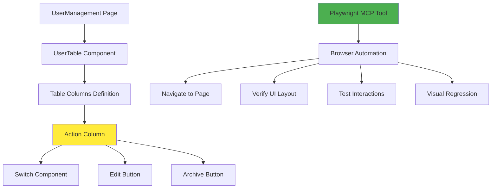

# Design Document

## Overview

本設計文件針對 Maintainer Manager 中 Group Management 列表頁面的 UI 佈局問題提供技術解決方案，並規劃使用 Playwright MCP 工具建立完整的 E2E 回歸測試。

目前 `UserTable` 組件的 Action 欄位存在佈局問題，主要原因是欄位寬度不足以容納 Switch 開關、Edit 按鈕和 Archive 按鈕三個操作元件，導致元件重疊或換行顯示。此設計將透過調整欄位寬度、優化 Flexbox 佈局和改善元件間距來解決問題。

同時，本設計規劃使用 Playwright MCP 工具建立測試套件，透過 MCP 協議與 Playwright 整合，無需在專案中安裝額外的測試依賴。

## Steering Document Alignment

### Technical Standards (tech.md)

本設計遵循以下技術標準：

1. **TypeScript 嚴格模式**：所有程式碼修改保持類型安全
2. **React 18 最佳實踐**：使用函數式組件和 Hooks
3. **Ant Design 設計規範**：遵循 Ant Design Table 組件的最佳實踐
4. **Tailwind CSS 樣式系統**：使用 Tailwind utility classes 進行樣式調整
5. **測試工具**：使用 Playwright MCP 工具進行瀏覽器自動化測試

### Project Structure (structure.md)

遵循專案組織規範：

1. **Feature-Based 模組化**：修改限制在 `src/features/maintainer-manager` 模組內
2. **組件職責分離**：UI 修復集中在 `UserTable.tsx`，不影響其他組件
3. **測試組織**：Playwright MCP 測試腳本將記錄在文件中，便於執行和維護
4. **命名慣例**：遵循 PascalCase（組件）、camelCase（函數）的命名規範

## Code Reuse Analysis

### Existing Components to Leverage

- **UserTable.tsx**：現有的使用者列表表格組件，將進行 Action 欄位的佈局優化
- **UserStatusBadge.tsx**：現有的狀態徽章組件，無需修改
- **userManagementServices.ts**：現有的 RTK Query API services，已包含所有必要的 API endpoints
- **Ant Design Table**：使用現有的 Table 組件，調整欄位配置
- **Ant Design Switch, Button**：使用現有的操作元件，優化樣式配置

### Integration Points

- **Playwright MCP 工具**：透過 Claude Code 的 MCP 整合，無需修改專案依賴
- **測試環境**：測試將在開發環境 (localhost) 執行，使用 MSW (Mock Service Worker) 提供測試資料
- **截圖存儲**：Playwright MCP 生成的截圖將存儲在專案目錄，便於視覺回歸比對

## Architecture

### Modular Design Principles

- **Single File Responsibility**：UI 修復僅修改 `UserTable.tsx` 的 Action 欄位定義
- **Component Isolation**：修改不影響其他欄位或組件的功能
- **Testing Modularity**：Playwright MCP 測試按功能場景組織，易於維護

### Architecture Diagram



## Components and Interfaces

### Component 1: UserTable - Action Column Fix

- **Purpose:** 修復 Action 欄位的佈局問題，使用自適應寬度確保所有操作元件正確顯示
- **File:** `src/features/maintainer-manager/components/UserTable.tsx`
- **Modification:**
  - **移除固定寬度** `width: 200`，改為不設置 width 或使用 `minWidth`
  - **使用相對定位**：不使用 `fixed: 'right'`，保持表格自然佈局
  - **優化 flex 容器佈局**：使用 `flex-nowrap` 確保元件不換行
  - **調整元件間距**：從 `gap-3` (12px) 調整為 `gap-2` (8px)
  - **添加防換行類別**：`whitespace-nowrap` 確保文字不換行
  - **防止元件收縮**：所有操作元件添加 `flex-shrink-0`
- **Design Principle:** 遵循自適應內容寬度和相對定位原則
- **Interfaces:** 保持現有的 `UserTableProps` 介面不變
- **Dependencies:**
  - Ant Design Table, Switch, Button 組件
  - Tailwind CSS utility classes
- **Reuses:**
  - 現有的 `handleStatusToggle` 和 `handleArchive` 函數
  - 現有的 RTK Query mutations

### Component 2: Playwright MCP Test Suite

- **Purpose:** 使用 Playwright MCP 工具建立完整的 E2E 測試套件
- **Test Scenarios:**
  1. **頁面導航測試**：驗證能正確導航至 Group Management 頁面
  2. **UI 元素驗證**：確認頁面標題、表格表頭、資料列存在
  3. **Action 欄位佈局測試**：驗證 Switch、Edit、Archive 按鈕正確顯示且不重疊
  4. **互動功能測試**：測試 Switch 切換、Edit 點擊、Archive 點擊的功能
  5. **視覺回歸測試**：對 Action 欄位進行截圖比對
  6. **分頁功能測試**：驗證分頁器正常運作
- **Interfaces:**
  - 使用 Playwright MCP 提供的瀏覽器操作 API
  - 透過 `mcp__playwright__*` 工具執行測試
- **Dependencies:**
  - Playwright MCP Server（透過 Claude Code MCP 整合）
  - 開發環境的應用程式 (localhost)
- **Reuses:**
  - 現有的 MSW mock handlers（如果有）
  - 現有的測試資料結構

## Data Models

### User Model (Existing)

```typescript
interface User {
  id: string;
  username: string;
  email: string;
  createdAt: string;
  updatedAt: string;
  notes?: string;
  status: 'active' | 'inactive' | 'archived';
}
```

### Test Data Model (For Playwright MCP)

```typescript
interface TestScenario {
  name: string;
  description: string;
  steps: string[];
  expectedResults: string[];
  screenshots?: string[];
}
```

## Detailed Design

### UI Fix: Action Column Width and Layout

#### Design Principle: 自適應佈局優先

**核心原則：** 使用相對定位和自適應內容寬度，避免固定寬度和絕對定位。讓瀏覽器根據內容自動計算最佳寬度。

#### Current Issue Analysis

```tsx
// 現有問題 (UserTable.tsx:134-186)
{
  title: 'Action',
  key: 'action',
  width: 200, // ❌ 固定寬度不足，無法容納所有元件
  render: (_, record) => (
    <div className="flex items-center gap-3"> {/* gap-3 = 12px，可能過大 */}
      {/* Switch: 約 60-80px */}
      <Switch ... />
      {/* Edit Button: 約 60-80px */}
      <Button ... >Edit</Button>
      {/* Archive Button: 約 70-90px */}
      <Button ... >Archive</Button>
    </div>
  )
}
```

**問題分析：**
1. ❌ 使用固定寬度 `width: 200` 限制了欄位空間
2. ❌ 三個元件總寬度約 190-250px，在 200px 固定寬度下會擠壓
3. ❌ 沒有使用自適應機制，在不同螢幕尺寸下表現不佳

#### Proposed Solution: 自適應寬度方案

```tsx
// 解決方案：移除固定寬度，使用自適應
{
  title: 'Action',
  key: 'action',
  // ✅ 不設置 width，讓 Ant Design Table 根據內容自動計算寬度
  // ✅ 或使用 minWidth 確保最小寬度，但不限制最大寬度
  render: (_, record) => {
    const isArchived = record.status === 'archived';

    return (
      <div className="flex items-center gap-2 flex-nowrap whitespace-nowrap">
        {/* ✅ gap-2 = 8px，在保持清晰間距的同時節省空間 */}
        {/* ✅ flex-nowrap 確保元件不換行 */}
        {/* ✅ whitespace-nowrap 防止文字換行 */}

        {/* 狀態切換開關 */}
        {!isArchived && (
          <Switch
            checked={record.status === 'active'}
            onChange={() => handleStatusToggle(record)}
            checkedChildren="Active"
            unCheckedChildren="Inactive"
            className="[&.ant-switch-checked]:bg-success flex-shrink-0"
            // ✅ flex-shrink-0 確保開關不會被壓縮
          />
        )}

        {/* 編輯按鈕 */}
        {!isArchived && (
          <Button
            type="text"
            icon={<EditOutlined />}
            onClick={() => onEdit?.(record)}
            className="flex items-center gap-1 px-2 hover:bg-blue-50 flex-shrink-0"
          >
            <span className="whitespace-nowrap">Edit</span>
            {/* ✅ 確保按鈕文字不換行 */}
          </Button>
        )}

        {/* 歸檔按鈕 */}
        {!isArchived && (
          <Button
            type="text"
            danger
            icon={<DeleteOutlined />}
            onClick={() => handleArchive(record)}
            className="flex items-center gap-1 px-2 hover:bg-error-light flex-shrink-0"
          >
            <span className="whitespace-nowrap">Archive</span>
            {/* ✅ 確保按鈕文字不換行 */}
          </Button>
        )}

        {/* archived 狀態提示 */}
        {isArchived && (
          <span className="text-gray-400 text-sm whitespace-nowrap">Archived</span>
        )}
      </div>
    );
  },
}
```

#### 替代方案：使用 minWidth（如需設置最小寬度）

```tsx
{
  title: 'Action',
  key: 'action',
  // ✅ 使用 minWidth 而非 width，確保最小寬度但允許自適應
  onCell: () => ({
    style: { minWidth: '220px' }
  }),
  render: (_, record) => {
    // ... 同上
  }
}
```

### Playwright MCP Testing Strategy

#### Test Suite Structure

使用 Playwright MCP 工具建立以下測試場景：

**1. 頁面導航與基本驗證**
```
- 使用 browser_navigate 導航至 Group Management 頁面
- 使用 browser_snapshot 獲取頁面結構
- 驗證頁面標題 "Group Management" 存在
- 驗證麵包屑 "Maintainer Manager / Group Management" 存在
```

**2. 表格結構驗證**
```
- 驗證表格表頭包含：Group Name, Max Members, Create Time, Updated Time, Notes, Status, Action
- 驗證至少有一筆資料列存在
- 驗證每一列的結構完整
```

**3. Action 欄位佈局驗證（核心測試）**
```
- 使用 browser_snapshot 獲取表格第一列的 Action 欄位
- 驗證 Switch 開關存在且可見
- 驗證 Edit 按鈕存在且可見
- 驗證 Archive 按鈕存在且可見
- 驗證三個元件在同一行顯示（不換行）
- 驗證元件之間有適當的間距
- 使用 browser_take_screenshot 對 Action 欄位截圖
```

**4. 互動功能測試**
```
- 測試 Switch 切換：
  - 使用 browser_click 點擊 Switch
  - 驗證 Modal 確認對話框出現
  - 點擊確認或取消

- 測試 Edit 按鈕：
  - 使用 browser_click 點擊 Edit 按鈕
  - 驗證編輯表單或頁面出現

- 測試 Archive 按鈕：
  - 使用 browser_click 點擊 Archive 按鈕
  - 驗證確認對話框出現
  - 驗證對話框內容正確
```

**5. 視覺回歸測試**
```
- 對整個頁面進行全頁截圖
- 對 Action 欄位進行局部截圖
- 將截圖與基準圖像比對（如果有）
- 記錄任何視覺差異
```

**6. 響應式測試（選填）**
```
- 使用 browser_resize 調整視窗大小
- 驗證 Action 欄位在不同尺寸下的佈局穩定性
```

#### Playwright MCP Tools Usage

本測試將使用以下 MCP 工具：

| 工具名稱 | 用途 |
|---------|------|
| `mcp__playwright__browser_navigate` | 導航至測試頁面 |
| `mcp__playwright__browser_snapshot` | 獲取頁面可訪問性快照 |
| `mcp__playwright__browser_take_screenshot` | 截圖用於視覺驗證 |
| `mcp__playwright__browser_click` | 點擊互動元素 |
| `mcp__playwright__browser_wait_for` | 等待元素或文字出現 |
| `mcp__playwright__browser_resize` | 調整視窗大小 |
| `mcp__playwright__browser_close` | 關閉瀏覽器 |

## Error Handling

### Error Scenarios

1. **場景：Action 欄位寬度仍不足**
   - **Handling：** 在測試中驗證元件是否重疊，如果發現問題，進一步增加寬度或優化佈局
   - **User Impact：** 使用者會看到操作按鈕正確排列，不會重疊

2. **場景：Playwright MCP 測試失敗**
   - **Handling：** 查看 Playwright MCP 返回的錯誤訊息和截圖，定位問題
   - **User Impact：** 不影響使用者，僅影響開發測試流程

3. **場景：Modal 確認對話框未出現**
   - **Handling：** 使用 `browser_wait_for` 等待對話框出現，設定合理的超時時間
   - **User Impact：** 確保操作確認流程正常運作

4. **場景：Switch 狀態更新失敗**
   - **Handling：** 由現有的 `baseQueryWithErrorHandler` 處理 API 錯誤，顯示錯誤訊息
   - **User Impact：** 使用者會看到錯誤提示，狀態保持原樣（樂觀更新自動回滾）

## Testing Strategy

### Unit Testing

- **範圍：** 不需要額外的單元測試，現有的 `UserTable.test.tsx` 和 `UserTable.simple.test.tsx` 已覆蓋組件邏輯
- **修改：** 如果現有測試因 UI 修改而失敗，更新測試快照或斷言

### Integration Testing

- **範圍：** 驗證 UserTable 與 RTK Query services 的整合
- **現有測試：** 已有 MSW mock handlers 和整合測試，確保修改後仍通過

### End-to-End Testing (Playwright MCP)

- **工具：** Playwright MCP 透過 Claude Code MCP 整合
- **測試場景：**
  1. **冒煙測試**：頁面載入、基本元素顯示
  2. **佈局測試**：Action 欄位的視覺驗證
  3. **功能測試**：Switch、Edit、Archive 的互動測試
  4. **回歸測試**：確保修改不破壞現有功能
- **執行方式：** 透過 Claude Code 執行 Playwright MCP 工具
- **測試文件：** 測試腳本和結果將記錄在實施日誌中

### Visual Regression Testing

- **方法：** 使用 Playwright MCP 的 `browser_take_screenshot` 功能
- **基準圖像：** 修復後的初始截圖作為基準
- **比對策略：** 手動或使用圖像比對工具驗證視覺差異
- **覆蓋範圍：**
  - Action 欄位局部截圖
  - 整個表格截圖
  - 不同狀態（active、inactive）的截圖

## Implementation Notes

### CSS 調整考量

**遵循設計原則：相對定位 + 自適應寬度**

1. **移除固定寬度：** 不使用 `width: 260` 等固定值，讓 Table 根據內容自動計算寬度
2. **相對定位：** 不使用 `fixed: 'right'`，保持表格的自然流動佈局
3. **自適應容器：** 使用 `flex` 和 `flex-nowrap` 讓容器根據子元件自動調整
4. **flex-shrink-0：** 防止 flex 項目在空間不足時收縮，確保按鈕和開關保持原始尺寸
5. **whitespace-nowrap：** 防止文字和內容換行，確保佈局整齊
6. **gap 調整：** 從 `gap-3` (12px) 調整為 `gap-2` (8px)，在保持視覺清晰的同時節省空間
7. **最小寬度（可選）：** 如需確保最小寬度，使用 `minWidth` 而非 `width`，例如 `onCell: () => ({ style: { minWidth: '220px' } })`

### 瀏覽器相容性

- **目標瀏覽器：** Chrome、Firefox、Safari、Edge（最新兩個版本）
- **Flexbox 支援：** 所有目標瀏覽器完全支援
- **Tailwind 相容性：** 已驗證

### 效能考量

- **UI 修改影響：** 僅調整 CSS，不影響渲染效能
- **測試執行時間：** Playwright MCP 測試預計 2-3 分鐘完成所有場景

## Rollout Plan

1. **階段 1：UI 修復**
   - 修改 `UserTable.tsx` 的 Action 欄位配置
   - 在本地測試驗證佈局正確
   - 執行現有的單元測試和整合測試

2. **階段 2：Playwright MCP 測試開發**
   - 使用 Playwright MCP 工具建立測試場景
   - 執行測試並記錄結果
   - 生成截圖和測試報告

3. **階段 3：文件與交付**
   - 更新實施日誌
   - 記錄測試腳本和執行步驟
   - 提供測試報告和截圖

## Alternatives Considered

### Alternative 1: 使用圖示按鈕（Icon-only Buttons）

**方案：** 移除按鈕文字，僅保留圖示

**優點：**
- 節省更多空間
- 視覺更簡潔

**缺點：**
- 降低可用性，使用者需要 hover 才能理解按鈕功能
- 不符合 Ant Design 的可用性原則

**決策：** ❌ 不採用，優先考慮可用性

### Alternative 2: 使用下拉選單（Dropdown Menu）

**方案：** 將 Edit 和 Archive 合併至下拉選單

**優點：**
- 大幅節省空間
- 可容納更多操作項目

**缺點：**
- 增加操作步驟（需點擊兩次）
- 降低常用操作的可訪問性

**決策：** ❌ 不採用，常用操作應直接可見

### Alternative 3: 使用固定寬度

**方案：** 設置 `width: 260` 固定欄位寬度

**優點：**
- 簡單直接
- 可預測的佈局

**缺點：**
- ❌ 違反設計原則：應優先使用自適應寬度
- ❌ 在不同螢幕尺寸下可能不夠靈活
- ❌ 固定寬度無法適應內容變化

**決策：** ❌ 不採用，改用自適應寬度方案

### Alternative 4: 安裝 Playwright 套件而非使用 MCP

**方案：** 在專案中安裝 `@playwright/test` 套件

**優點：**
- 傳統的測試開發方式
- 可整合至 CI/CD 流程

**缺點：**
- 需要安裝額外依賴
- 增加專案體積和維護成本

**決策：** ❌ 不採用，使用 Playwright MCP 更靈活且無需安裝依賴
