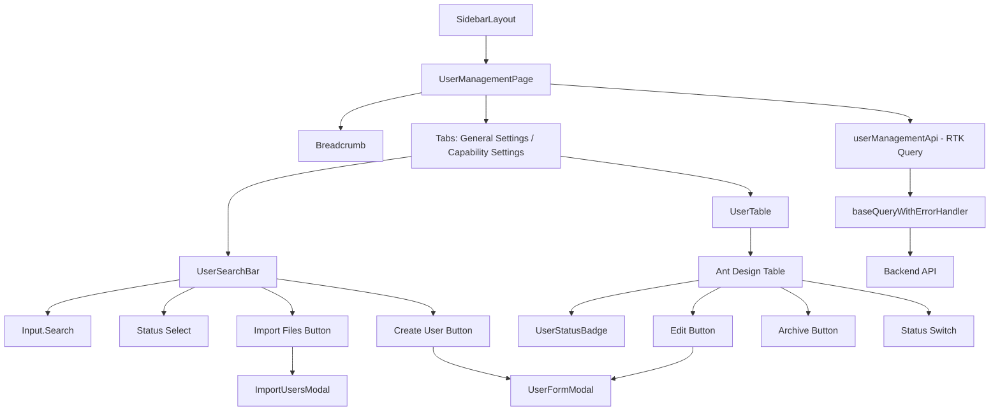

# Design Document - User Management

## Overview

User Management 頁面是一個完整的使用者管理介面，採用 **Feature-based 模組化架構**，整合 React 18、TypeScript、Ant Design、Tailwind CSS 與 Redux Toolkit Query。此設計遵循專案既有的架構模式，重用共用元件（Sidebar、SidebarLayout），並透過 RTK Query 管理所有 API 互動。

主要技術特點：
- **模組化設計**：所有程式碼放置於 `src/features/maintainer-manager/` 目錄
- **狀態管理**：使用 RTK Query 進行 API 快取與狀態同步
- **UI 框架**：Ant Design Table、Form、Modal、Button 等企業級元件
- **樣式系統**：Tailwind CSS v3 utilities + 專案 design tokens
- **類型安全**：完整的 TypeScript 類型定義

此頁面將整合進既有的 SidebarLayout，作為 "Maintainer Manager" 功能的子頁面（路由：`/maintainer/users`）。

## Steering Document Alignment

### Technical Standards (tech.md)

本設計完全遵循 `tech.md` 中定義的技術標準：

1. **核心框架與工具**
   - React 18.3.1：使用函式型元件 + Hooks
   - TypeScript 5.6.2：嚴格模式，所有元件與函數完整類型定義
   - Redux Toolkit 2.5.0 + RTK Query：API 呼叫與快取管理
   - Ant Design 5.22.2：Table、Form、Modal、Button、Select 等元件
   - Tailwind CSS 3.4.15：utilities-first 樣式系統

2. **Feature-Based 架構**
   - 採用 feature-based 資料夾結構
   - 使用路徑別名 `@features`、`@shared`
   - RTK Query services 管理 API 呼叫

3. **資料儲存與快取**
   - RTK Query 自動快取 API 回應
   - localStorage 儲存分頁偏好設定（可選）

4. **錯誤處理**
   - 使用 `baseQueryWithErrorHandler` 統一處理 API 錯誤
   - Ant Design `message` 顯示錯誤訊息

5. **程式碼品質**
   - ESLint 9.13.0 + TypeScript ESLint
   - 遵循 React Hooks 規則
   - 單一職責原則、模組化設計

### Project Structure (structure.md)

本實作遵循 `structure.md` 定義的專案組織規範：

```
src/
├── features/
│   └── maintainer-manager/          # ← 新增功能模組
│       ├── components/               # 使用者管理相關元件
│       │   ├── UserTable.tsx        # 使用者列表表格元件
│       │   ├── UserSearchBar.tsx    # 搜尋與篩選列
│       │   ├── UserFormModal.tsx    # 建立/編輯使用者表單
│       │   ├── ImportUsersModal.tsx # 批次匯入對話框
│       │   └── UserStatusBadge.tsx  # 狀態 badge 元件
│       ├── pages/                    # 頁面元件
│       │   └── UserManagement.tsx   # 主頁面元件
│       ├── services/                 # API services (RTK Query)
│       │   └── userManagementServices.ts
│       ├── types/                    # TypeScript 類型定義
│       │   └── user.types.ts
│       ├── hooks/                    # 自訂 hooks（如需要）
│       │   └── useUserFilters.ts    # 搜尋與篩選邏輯
│       └── index.ts                  # 模組統一導出
│
├── shared/                           # 重用既有共用資源
│   ├── layouts/SidebarLayout.tsx    # ← 重用
│   ├── components/Sidebar.tsx       # ← 重用
│   └── services/
│       └── baseQueryWithErrorHandler.ts  # ← 重用
│
└── routes.tsx                        # 新增路由定義
```

**檔案命名慣例**：
- 元件：`PascalCase.tsx`（例如：`UserTable.tsx`）
- Services：`camelCase` + `Services.ts`（例如：`userManagementServices.ts`）
- Types：`kebab-case.types.ts`（例如：`user.types.ts`）
- Hooks：`use` + `PascalCase.ts`（例如：`useUserFilters.ts`）

## Code Reuse Analysis

### Existing Components to Leverage

1. **SidebarLayout** (`src/shared/layouts/SidebarLayout.tsx`)
   - **用途**：作為 User Management 頁面的佈局容器
   - **整合方式**：
     ```tsx
     <SidebarLayout sidebarItems={maintainerSidebarItems} activeId="users">
       <UserManagementPage />
     </SidebarLayout>
     ```
   - **優點**：提供響應式側邊欄、漢堡選單、桌面/手機版自動切換

2. **Sidebar** (`src/shared/components/Sidebar.tsx`)
   - **用途**：導航元件，顯示 "Maintainer Manager" 子選單
   - **配置**：
     ```tsx
     {
       id: "maintainer",
       label: "Maintainer manager",
       icon: <SafetyOutlined />,
       children: [
         { id: "node", label: "Node", href: "/maintainer/node" },
         { id: "users", label: "Users", href: "/maintainer/users" }, // ← 新增
         { id: "maintainer-group", label: "Group", href: "/maintainer/group" },
       ],
     }
     ```

3. **baseQueryWithErrorHandler** (`src/shared/services/baseQueryWithErrorHandler.ts`)
   - **用途**：統一處理 API 錯誤、顯示錯誤訊息
   - **整合方式**：RTK Query API 使用此 baseQuery

4. **Ant Design 元件**
   - **Table**：使用者列表展示、分頁、排序
   - **Form**：建立/編輯使用者表單
   - **Modal**：對話框（建立使用者、批次匯入、確認刪除）
   - **Input.Search**：搜尋框
   - **Select**：狀態篩選下拉選單
   - **Button**：操作按鈕（Create User、Import Files、Edit、Archive）
   - **Badge / Tag**：狀態顯示（Active、Inactive、Archived）
   - **Switch**：狀態切換開關
   - **Upload**：檔案上傳（批次匯入）
   - **Tabs**：General Settings / Capability Settings 切換

### Integration Points

1. **React Router DOM 7.0.1**
   - 路由定義：`/maintainer/users`
   - 麵包屑導航：`Maintainer Manager / User Management`

2. **Redux Store**
   - 整合 `userManagementApi.reducerPath` 至 store
   - 使用 RTK Query middleware

3. **i18next 國際化**
   - 所有介面文字使用 `t('user_management.xxx')` 格式
   - 支援繁體中文 / 英文切換

4. **API 端點**（假設後端提供）
   - `GET /api/users` - 取得使用者列表（支援分頁、搜尋、篩選）
   - `POST /api/users` - 建立新使用者
   - `PUT /api/users/:id` - 更新使用者資訊
   - `PATCH /api/users/:id/status` - 切換使用者狀態
   - `DELETE /api/users/:id` - 歸檔使用者
   - `POST /api/users/import` - 批次匯入使用者

## Architecture

### 系統架構圖



### Modular Design Principles

1. **Single File Responsibility**
   - `UserManagementPage.tsx`：主頁面容器，整合各子元件
   - `UserTable.tsx`：負責列表展示、分頁、操作按鈕
   - `UserSearchBar.tsx`：負責搜尋、篩選、頂部操作按鈕
   - `UserFormModal.tsx`：負責建立/編輯表單邏輯
   - `ImportUsersModal.tsx`：負責批次匯入流程
   - `UserStatusBadge.tsx`：負責狀態顯示（可重用）

2. **Component Isolation**
   - 每個元件獨立、可測試
   - 透過 props 傳遞資料與回調函數
   - 避免元件間直接相互依賴

3. **Service Layer Separation**
   - API 邏輯完全封裝在 `userManagementServices.ts`
   - 元件透過 RTK Query hooks 呼叫 API
   - 業務邏輯與 UI 分離

4. **Utility Modularity**
   - `useUserFilters` hook：封裝搜尋與篩選邏輯
   - 表單驗證規則可提取為 `validationRules.ts`（如複雜）

### 資料流設計

```
使用者操作 → 元件事件處理 → RTK Query mutation/query → API 呼叫
    ↓
API 回應 → RTK Query 自動更新快取 → 元件重新渲染 → UI 更新
```

**樂觀更新（Optimistic Update）**：
- 狀態切換（Active ↔ Inactive）採用樂觀更新
- 失敗時自動回滾

## Components and Interfaces

### 1. UserManagementPage

- **Purpose**: 主頁面容器，整合所有子元件，管理頁面級狀態
- **Interfaces**:
  ```tsx
  const UserManagementPage: React.FC = () => {
    // 狀態：當前 tab、搜尋條件、篩選器
    const [activeTab, setActiveTab] = useState<'general' | 'capability'>('general');

    return (
      <SidebarLayout sidebarItems={maintainerSidebarItems} activeId="users">
        <div className="p-6">
          <Breadcrumb />
          <h1>User Management</h1>
          <Tabs activeKey={activeTab} onChange={setActiveTab}>
            <TabPane tab="General Settings" key="general">
              <UserSearchBar />
              <UserTable />
            </TabPane>
            <TabPane tab="Capability Settings" key="capability">
              {/* Coming soon */}
            </TabPane>
          </Tabs>
        </div>
      </SidebarLayout>
    );
  };
  ```
- **Dependencies**: `SidebarLayout`, `UserSearchBar`, `UserTable`, `Ant Design Breadcrumb/Tabs`
- **Reuses**: `SidebarLayout` (共用佈局)

### 2. UserSearchBar

- **Purpose**: 搜尋列與頂部操作按鈕
- **Interfaces**:
  ```tsx
  interface UserSearchBarProps {
    onSearchChange: (keyword: string) => void;
    onStatusFilterChange: (status: string) => void;
    onImportClick: () => void;
    onCreateClick: () => void;
  }

  const UserSearchBar: React.FC<UserSearchBarProps> = (props) => {
    return (
      <div className="flex gap-4 mb-4">
        <Input.Search placeholder="Search User name" onChange={...} />
        <Select defaultValue="all" onChange={props.onStatusFilterChange}>
          <Option value="all">All Status</Option>
          <Option value="active">Active</Option>
          <Option value="inactive">Inactive</Option>
          <Option value="archived">Archived</Option>
        </Select>
        <Button onClick={props.onImportClick}>Import Files</Button>
        <Button type="primary" onClick={props.onCreateClick}>Create User</Button>
      </div>
    );
  };
  ```
- **Dependencies**: `Ant Design Input.Search, Select, Button`
- **Reuses**: Ant Design 標準元件

### 3. UserTable

- **Purpose**: 使用者列表表格，包含分頁、狀態 badge、操作按鈕
- **Interfaces**:
  ```tsx
  interface UserTableProps {
    searchKeyword: string;
    statusFilter: string;
  }

  const UserTable: React.FC<UserTableProps> = ({ searchKeyword, statusFilter }) => {
    const { data, isLoading } = useGetUsersQuery({ search: searchKeyword, status: statusFilter });
    const [updateStatus] = useUpdateUserStatusMutation();
    const [archiveUser] = useArchiveUserMutation();

    const columns = [
      { title: 'User Name', dataIndex: 'username', key: 'username' },
      { title: 'Create Time', dataIndex: 'createdAt', key: 'createdAt' },
      { title: 'Updated Time', dataIndex: 'updatedAt', key: 'updatedAt' },
      { title: 'Notes', dataIndex: 'notes', key: 'notes' },
      {
        title: 'Status',
        key: 'status',
        render: (_, record) => <UserStatusBadge status={record.status} />
      },
      {
        title: 'Action',
        key: 'action',
        render: (_, record) => (
          <>
            <Switch checked={record.status === 'active'} onChange={() => updateStatus(record.id)} />
            <Button onClick={() => handleEdit(record)}>Edit</Button>
            <Button onClick={() => archiveUser(record.id)}>Archive</Button>
          </>
        )
      }
    ];

    return (
      <Table
        columns={columns}
        dataSource={data?.users}
        loading={isLoading}
        pagination={{
          total: data?.total,
          pageSize: 10,
          showTotal: (total) => `Total ${total} items`
        }}
      />
    );
  };
  ```
- **Dependencies**: `Ant Design Table, Switch, Button`, `userManagementServices` (RTK Query)
- **Reuses**: `UserStatusBadge`

### 4. UserStatusBadge

- **Purpose**: 顯示使用者狀態的語義化 badge
- **Interfaces**:
  ```tsx
  interface UserStatusBadgeProps {
    status: 'active' | 'inactive' | 'archived';
  }

  const UserStatusBadge: React.FC<UserStatusBadgeProps> = ({ status }) => {
    const config = {
      active: { color: 'bg-success-light text-success', text: 'Active' },
      inactive: { color: 'bg-error-light text-error', text: 'Inactive' },
      archived: { color: 'bg-gray-200 text-gray-500', text: 'Archived' },
    };

    return (
      <span className={`px-2 py-1 rounded ${config[status].color}`}>
        {config[status].text}
      </span>
    );
  };
  ```
- **Dependencies**: Tailwind CSS utilities
- **Reuses**: 專案 design tokens (`bg-success-light`, `text-success`, etc.)

### 5. UserFormModal

- **Purpose**: 建立/編輯使用者的表單對話框
- **Interfaces**:
  ```tsx
  interface UserFormModalProps {
    visible: boolean;
    mode: 'create' | 'edit';
    initialValues?: User;
    onClose: () => void;
    onSubmit: (values: UserFormValues) => void;
  }

  const UserFormModal: React.FC<UserFormModalProps> = (props) => {
    const [form] = Form.useForm();
    const [createUser, { isLoading: isCreating }] = useCreateUserMutation();
    const [updateUser, { isLoading: isUpdating }] = useUpdateUserMutation();

    const handleSubmit = async (values: UserFormValues) => {
      try {
        if (props.mode === 'create') {
          await createUser(values).unwrap();
        } else {
          await updateUser({ id: props.initialValues!.id, ...values }).unwrap();
        }
        message.success('Success');
        props.onClose();
      } catch (error) {
        // 錯誤已由 baseQueryWithErrorHandler 處理
      }
    };

    return (
      <Modal
        visible={props.visible}
        title={props.mode === 'create' ? 'Create User' : 'Edit User'}
        onCancel={props.onClose}
        footer={null}
      >
        <Form form={form} onFinish={handleSubmit} initialValues={props.initialValues}>
          <Form.Item name="username" label="User Name" rules={[{ required: true }]}>
            <Input />
          </Form.Item>
          <Form.Item name="email" label="Email" rules={[{ required: true, type: 'email' }]}>
            <Input />
          </Form.Item>
          <Form.Item name="notes" label="Notes">
            <Input.TextArea />
          </Form.Item>
          <Form.Item>
            <Button type="primary" htmlType="submit" loading={isCreating || isUpdating}>
              Submit
            </Button>
          </Form.Item>
        </Form>
      </Modal>
    );
  };
  ```
- **Dependencies**: `Ant Design Modal, Form, Input`, `userManagementServices`
- **Reuses**: Ant Design Form 驗證規則

### 6. ImportUsersModal

- **Purpose**: 批次匯入使用者的對話框
- **Interfaces**:
  ```tsx
  interface ImportUsersModalProps {
    visible: boolean;
    onClose: () => void;
  }

  const ImportUsersModal: React.FC<ImportUsersModalProps> = ({ visible, onClose }) => {
    const [importUsers, { isLoading }] = useImportUsersMutation();
    const [fileList, setFileList] = useState<UploadFile[]>([]);

    const handleUpload = async () => {
      const formData = new FormData();
      fileList.forEach(file => formData.append('files', file as any));

      try {
        const result = await importUsers(formData).unwrap();
        message.success(`Success: ${result.successCount}, Failed: ${result.failedCount}`);
        onClose();
      } catch (error) {
        // 錯誤已處理
      }
    };

    return (
      <Modal visible={visible} title="Import Users" onCancel={onClose}>
        <Upload
          fileList={fileList}
          onChange={({ fileList }) => setFileList(fileList)}
          accept=".csv,.xlsx"
          beforeUpload={() => false}
        >
          <Button>Select File</Button>
        </Upload>
        <Button type="primary" onClick={handleUpload} loading={isLoading}>
          Upload
        </Button>
      </Modal>
    );
  };
  ```
- **Dependencies**: `Ant Design Modal, Upload, Button`, `userManagementServices`
- **Reuses**: Ant Design Upload 元件

### 7. userManagementServices (RTK Query)

- **Purpose**: 封裝所有使用者管理相關的 API 呼叫
- **Interfaces**:
  ```tsx
  import { createApi } from '@reduxjs/toolkit/query/react';
  import baseQueryWithErrorHandler from '@shared/services/baseQueryWithErrorHandler';
  import type { User, UserFormValues, UsersResponse } from '../types/user.types';

  export const userManagementApi = createApi({
    reducerPath: 'userManagementApi',
    baseQuery: baseQueryWithErrorHandler,
    tagTypes: ['Users'],
    endpoints: (builder) => ({
      getUsers: builder.query<UsersResponse, { search?: string; status?: string; page?: number }>({
        query: (params) => ({
          url: '/api/users',
          method: 'GET',
          params,
        }),
        providesTags: ['Users'],
      }),
      createUser: builder.mutation<User, UserFormValues>({
        query: (body) => ({
          url: '/api/users',
          method: 'POST',
          body,
        }),
        invalidatesTags: ['Users'],
      }),
      updateUser: builder.mutation<User, { id: string } & UserFormValues>({
        query: ({ id, ...body }) => ({
          url: `/api/users/${id}`,
          method: 'PUT',
          body,
        }),
        invalidatesTags: ['Users'],
      }),
      updateUserStatus: builder.mutation<User, { id: string; status: string }>({
        query: ({ id, status }) => ({
          url: `/api/users/${id}/status`,
          method: 'PATCH',
          body: { status },
        }),
        // 樂觀更新
        async onQueryStarted({ id, status }, { dispatch, queryFulfilled }) {
          const patchResult = dispatch(
            userManagementApi.util.updateQueryData('getUsers', undefined, (draft) => {
              const user = draft.users.find(u => u.id === id);
              if (user) user.status = status;
            })
          );
          try {
            await queryFulfilled;
          } catch {
            patchResult.undo();
          }
        },
      }),
      archiveUser: builder.mutation<void, string>({
        query: (id) => ({
          url: `/api/users/${id}`,
          method: 'DELETE',
        }),
        invalidatesTags: ['Users'],
      }),
      importUsers: builder.mutation<{ successCount: number; failedCount: number }, FormData>({
        query: (formData) => ({
          url: '/api/users/import',
          method: 'POST',
          body: formData,
        }),
        invalidatesTags: ['Users'],
      }),
    }),
  });

  export const {
    useGetUsersQuery,
    useCreateUserMutation,
    useUpdateUserMutation,
    useUpdateUserStatusMutation,
    useArchiveUserMutation,
    useImportUsersMutation,
  } = userManagementApi;
  ```
- **Dependencies**: `@reduxjs/toolkit/query/react`, `baseQueryWithErrorHandler`
- **Reuses**: `baseQueryWithErrorHandler` (共用錯誤處理)

### 8. useUserFilters (Custom Hook)

- **Purpose**: 封裝搜尋與篩選邏輯，簡化元件程式碼
- **Interfaces**:
  ```tsx
  interface UseUserFiltersReturn {
    searchKeyword: string;
    statusFilter: string;
    setSearchKeyword: (keyword: string) => void;
    setStatusFilter: (status: string) => void;
  }

  const useUserFilters = (): UseUserFiltersReturn => {
    const [searchKeyword, setSearchKeyword] = useState('');
    const [statusFilter, setStatusFilter] = useState('all');

    // 搜尋防抖處理
    const debouncedSearch = useMemo(
      () => debounce(setSearchKeyword, 300),
      []
    );

    return {
      searchKeyword,
      statusFilter,
      setSearchKeyword: debouncedSearch,
      setStatusFilter,
    };
  };
  ```
- **Dependencies**: React hooks (`useState`, `useMemo`)
- **Reuses**: Lodash `debounce` 或自訂實作

## Data Models

### User

```typescript
interface User {
  id: string;                  // 使用者唯一識別碼
  username: string;            // 使用者名稱
  email: string;               // 電子郵件
  status: 'active' | 'inactive' | 'archived';  // 狀態
  notes?: string;              // 備註
  createdAt: string;           // 建立時間（ISO 8601）
  updatedAt: string;           // 更新時間（ISO 8601）
}
```

### UserFormValues

```typescript
interface UserFormValues {
  username: string;
  email: string;
  notes?: string;
  password?: string;           // 僅建立時需要
}
```

### UsersResponse

```typescript
interface UsersResponse {
  users: User[];               // 使用者列表
  total: number;               // 總筆數
  page: number;                // 當前頁碼
  pageSize: number;            // 每頁筆數
}
```

### ImportUsersResult

```typescript
interface ImportUsersResult {
  successCount: number;        // 成功匯入數量
  failedCount: number;         // 失敗數量
  errors?: Array<{             // 錯誤詳情
    row: number;
    reason: string;
  }>;
}
```

## Error Handling

### Error Scenarios

#### 1. API 呼叫失敗（網路錯誤、500 錯誤）
- **Handling**: `baseQueryWithErrorHandler` 自動顯示錯誤訊息
- **User Impact**: 顯示 Ant Design `message.error`，告知使用者操作失敗
- **Recovery**: 提供重試按鈕或自動重試機制

#### 2. 表單驗證失敗
- **Handling**: Ant Design Form 即時驗證，顯示錯誤訊息於欄位下方
- **User Impact**: 紅色錯誤提示，阻止表單提交
- **Recovery**: 使用者修正錯誤後即可提交

#### 3. 使用者不存在（編輯/歸檔時）
- **Handling**: API 回傳 404，`baseQueryWithErrorHandler` 顯示 "User not found"
- **User Impact**: 錯誤訊息，自動重新載入列表
- **Recovery**: 使用者看到最新列表

#### 4. 權限不足（403 Forbidden）
- **Handling**: `baseQueryWithErrorHandler` 顯示 "Permission denied"
- **User Impact**: 錯誤訊息，操作按鈕可能灰階顯示
- **Recovery**: 引導使用者聯繫管理員

#### 5. 批次匯入檔案格式錯誤
- **Handling**: 前端驗證檔案副檔名（`.csv`, `.xlsx`），後端驗證檔案內容
- **User Impact**: 顯示錯誤訊息，列出具體錯誤行數與原因
- **Recovery**: 提供範例檔案下載，使用者修正後重新上傳

#### 6. 樂觀更新失敗（狀態切換）
- **Handling**: RTK Query 自動回滾 UI 至原始狀態
- **User Impact**: Switch 開關恢復原始狀態，顯示錯誤訊息
- **Recovery**: 使用者可重試操作

#### 7. 列表載入失敗
- **Handling**: 顯示空狀態或錯誤提示，提供重試按鈕
- **User Impact**: 顯示 "Failed to load users. Please try again."
- **Recovery**: 點擊重試按鈕重新載入

## Testing Strategy

### Unit Testing

**工具**: Vitest + React Testing Library

**測試範圍**:
1. **元件測試**
   - `UserStatusBadge`: 測試不同 status 是否渲染正確顏色與文字
   - `UserSearchBar`: 測試搜尋框、下拉選單、按鈕的互動
   - `UserFormModal`: 測試表單驗證、提交邏輯

2. **Hooks 測試**
   - `useUserFilters`: 測試 debounce 行為、狀態更新

3. **Services 測試**
   - Mock RTK Query，測試 API 呼叫參數是否正確
   - 測試 optimistic update 邏輯

**範例**:
```typescript
describe('UserStatusBadge', () => {
  it('renders active badge with correct color', () => {
    const { getByText } = render(<UserStatusBadge status="active" />);
    const badge = getByText('Active');
    expect(badge).toHaveClass('bg-success-light', 'text-success');
  });
});
```

### Integration Testing

**工具**: Vitest + React Testing Library

**測試範圍**:
1. **完整流程測試**
   - 搜尋 → 篩選 → 列表更新
   - 建立使用者 → 列表自動重新載入 → 新使用者出現
   - 狀態切換 → 樂觀更新 → API 成功/失敗回滾

2. **元件整合測試**
   - `UserManagementPage` 整合所有子元件
   - 測試 props 傳遞、事件回調

**範例**:
```typescript
describe('UserManagementPage', () => {
  it('creates new user and updates list', async () => {
    const { getByText, getByRole } = render(<UserManagementPage />);

    // 點擊 Create User 按鈕
    fireEvent.click(getByText('Create User'));

    // 填寫表單
    const usernameInput = getByRole('textbox', { name: /user name/i });
    fireEvent.change(usernameInput, { target: { value: 'John Doe' } });

    // 提交表單
    fireEvent.click(getByText('Submit'));

    // 驗證列表更新
    await waitFor(() => {
      expect(getByText('John Doe')).toBeInTheDocument();
    });
  });
});
```

### End-to-End Testing

**工具**: Playwright

**測試範圍**:
1. **使用者完整旅程**
   - 登入 → 導航至 User Management → 建立使用者 → 驗證成功
   - 搜尋使用者 → 編輯 → 儲存 → 驗證更新
   - 歸檔使用者 → 確認對話框 → 驗證列表移除

2. **視覺回歸測試**（根據 `/figma-page` 要求）
   - 截圖比對：確保頁面佈局與 Figma 設計一致
   - 測試不同狀態：空狀態、載入中、有資料、錯誤狀態

**範例**:
```typescript
test('user management visual regression', async ({ page }) => {
  await page.goto('/maintainer/users');
  await page.waitForSelector('table');

  // 截圖比對
  await expect(page).toHaveScreenshot('user-management-page.png');
});
```

### 測試覆蓋率目標
- **元件覆蓋率**: > 80%
- **關鍵業務邏輯**: 100%（建立、編輯、歸檔、狀態切換）
- **錯誤處理路徑**: > 70%
